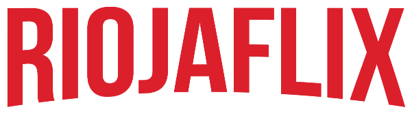
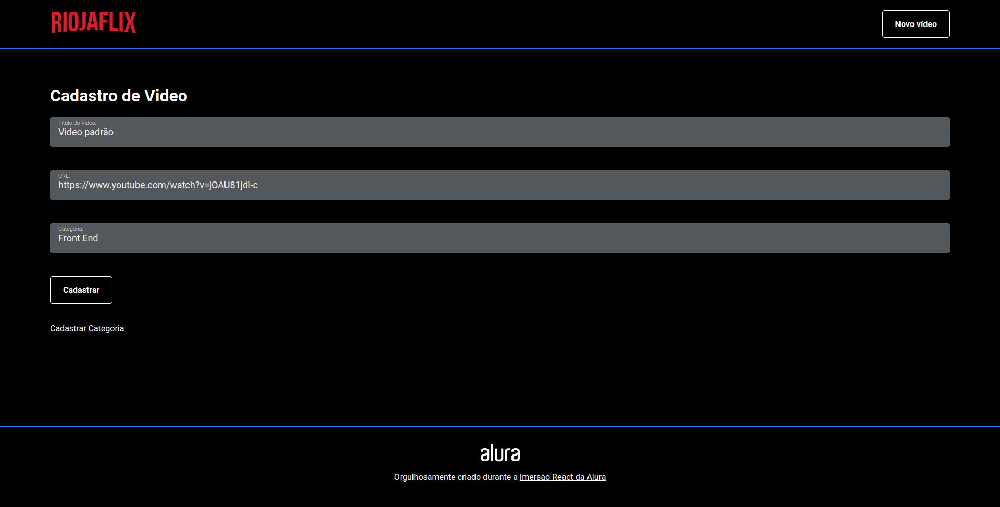
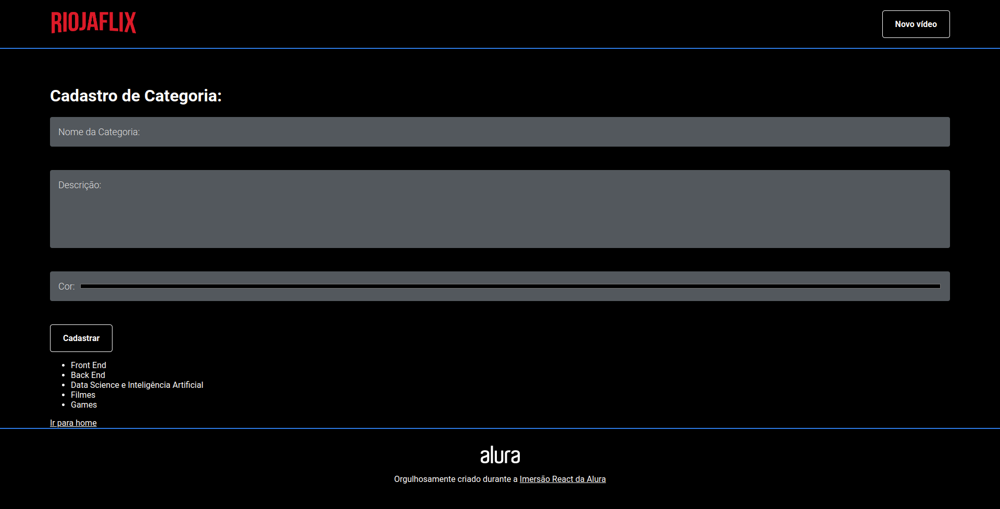

<p align="center">
  
  <br>
</p>

<p align="center">
  
  
  
  
</p>

<p align="center">
  <a href="#sobre">Sobre</a> •
  <a href="#riojaflix">Riojaflix</a> •
  <a href="#instalação">Instalação</a> •
  <a href="#tecnologias">Tecnologias</a> •
  <a href="#autor">Autor</a>  
</p>

## Sobre

Projeto criado durante a Imersão de React criada pela [Alura](https://www.alura.com.br/).

## Riojaflix

O Riojaflix é um projeto inspirado na Netflix cujo objetivo principal é entender como construir interfaces utilizando ReactJS e StyledComponents.

O projeto funciona como um aglomerado de vídeos que são carregados da nossa API fake construída com JSON server. Ao acessar a homepage da aplicação a visualização é semelhante a essa:


Como podemos ver acima, temos um cabeçalho onde, no canto superior direito temos um botão para cadastro de novos videos, logo após um banner com um video destaque e mais abaixo as categorias previamente cadastradas juntamente com seus vídeos.

Ao clicar no botão `Novo video`, o usuário é direcionado para a tela abaixo que conterá campos para ele adicionar as informações do novo conteúdo para que ele seja classificado e exibido no local correto após o cadastro:



Na tela de cadastro de video, abaixo do botão cadastrar, temos um link para cadastrar uma categoria. Ao clicar no link o formulário abaixo é exibido para que uma nova categoria seja criada:



Por fim, esse é o fluxo da aplicação. Simples porém cumpriu o objetivo de praticar a implementação de interfaces com ReactJS.

Deixo abaixo um GIF onde navego pela aplicação e cadastro um novo video para exemplificar o funcionamento do projeto:


## Instalação

Antes de começar, você vai precisar ter instalado em sua máquina as seguintes ferramentas:
[Git](https://git-scm.com), [Node.js](https://nodejs.org/en/).
Além disso é bom ter um editor para trabalhar com o código como [VSCode](https://code.visualstudio.com/).

### 🖥️ Rodando o Front End (Web)

```bash
# Clone este repositório
$ git clone git@github.com:MrRioja/riojaflix.git

# Acesse a pasta do projeto no terminal/cmd
$ cd riojaflix

# Instale as dependências
$ npm install
# Caso prefira usar o Yarn execute o comando abaixo
$ yarn

# Execute a aplicação em modo de desenvolvimento
$ npm run dev
# Caso prefira usar o Yarn execute o comando abaixo
$ yarn dev

# O servidor iniciará na porta 3000 - acesse <http://localhost:3000>
# Além disso, uma API com JSON server também estará disponível na porta 8000 - acesse <http://localhost:8000>
```

## Tecnologias


<br><br><br>

## Autor

<div align="center">

<h1>Luiz Rioja</h1>
<strong>Backend Developer</strong>
<br/>
<br/>

<a href="https://linkedin.com/in/luizrioja" target="_blank">

</a>

<a href="https://github.com/mrrioja" target="_blank">

</a>

<a href="mailto:lulyrioja@gmail.com?subject=Fala%20Dev" target="_blank">

</a>

<a href="https://api.whatsapp.com/send?phone=5511933572652" target="_blank">

</a>

<a href="https://join.skype.com/invite/tvBbOq03j5Uu" target="_blank">

</a>

<br/>
<br/>
</div>
